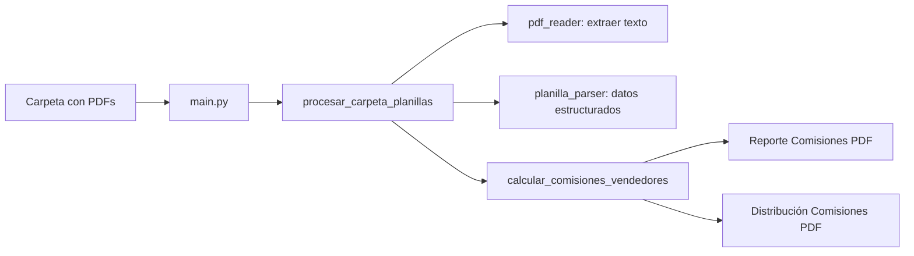

# Automatización de Comisiones

Herramienta en Python para procesar planillas de cobranza en PDF, calcular la distribución mensual de comisiones por vendedor y generar reportes en PDF listos para revisión.

## Objetivo

Automatizar un proceso que antes se hacía de forma manual: leer las planillas de cobranza de las empresas **Di Pascuale (DP)** y **Fills**, asignar cada cliente a su vendedor, aplicar las reglas de comisión correspondientes y producir dos documentos consolidados por mes:

1. **Reporte de Comisiones** — detalle por planilla, tipo de informe y totales por empresa.
2. **Distribución de Comisiones** — totales acumulados por vendedor y empresa.

## Alcance

| Incluye | No incluye |
|--------|------------|
| Lectura automática de PDFs (digital, ZIP con `.txt` internos u OCR como respaldo) | Interfaz gráfica |
| Detección de empresa y tipo de informe desde el **nombre del archivo** | Integración con bases de datos o ERP |
| Cálculo de comisiones con reglas estándar y excepciones por cliente | Edición de planillas originales |
| Generación de PDFs de salida en la misma carpeta de entrada | Procesamiento de otros formatos (Excel, CSV, etc.) |

### Empresas y tipos de planilla

- **Empresa**: se infiere del nombre del archivo. Debe contener `DP` o `Fills`.
- **Tipo de informe**: se infiere del número entre paréntesis en el nombre: `(1)` o `(2)`.
  - **Tipo 1**: comisiones calculadas sobre el neto sin IVA (subtotal ÷ 1,21).
  - **Tipo 2**: comisiones sobre el subtotal directo.

Ejemplos de nombres válidos:

- `Planilla N° 88 DP (1).pdf`
- `Planilla N° 13 Fills (2).pdf`

Los PDFs generados por este mismo script (`Reporte Comisiones…`, `Distribución Comisiones…`) se ignoran al reprocesar la carpeta.

## Estructura del proyecto

```
Automatizaci-nComisiones/
├── main.py                    # Punto de entrada
├── clientes_vendedor.py       # Mapas cliente→vendedor y reglas de comisión
├── DistribucionMensualCom.py  # Procesamiento, cálculo y generación de PDFs
├── planilla_parser.py         # Parseo de texto/tablas de planillas
├── pdf_reader.py              # Extracción de texto (pdfplumber / ZIP / OCR)
├── ComisionMensual.py         # Módulo auxiliar (flujo alternativo)
├── requirements.txt
├── PlanillasCobranza/         # Carpeta de ejemplo para PDFs de entrada
└── versión1/                  # Implementación anterior (OCR obligatorio); no usar en producción
```

## Requisitos

- **Python 3.9+** (recomendado 3.10 o superior)
- Dependencias Python: ver `requirements.txt`
- **Opcional (solo PDFs escaneados):**
  - **macOS:** `brew install tesseract poppler`
  - **Windows:** Tesseract-OCR y Poppler (ver comentarios en `pdf_reader.py`)

## Instalación

### 1. Clonar el repositorio

```bash
git clone <url-del-repositorio>
cd Automatizaci-nComisiones
```

### 2. Crear y activar el entorno virtual

**macOS / Linux:**

```bash
python3 -m venv .venv
source .venv/bin/activate
```

**Windows (PowerShell):**

```powershell
python -m venv .venv
.venv\Scripts\Activate.ps1
```

### 3. Instalar dependencias

```bash
pip install --upgrade pip
pip install -r requirements.txt
```

### 4. Configurar el editor (opcional)

Si usás Cursor o VS Code, el proyecto incluye `.vscode/settings.json` y `pyrightconfig.json` para que el analizador use el intérprete de `.venv`. Si ves avisos de imports no resueltos, elegí **Python: Select Interpreter** → `.venv/bin/python`.

## Uso

### Preparar la carpeta de planillas

1. Creá una carpeta (por ejemplo `PlanillasCobranza/`) con los PDF de las planillas del mes.
2. Verificá que cada archivo cumpla las convenciones de nombre (`DP` o `Fills`, y `(1)` o `(2)`).
3. No mezcles en esa carpeta los reportes ya generados si vas a volver a ejecutar el proceso (el script los omite por nombre, pero es buena práctica mantener solo planillas de entrada).

### Ejecutar el proceso

Con el entorno virtual activado, desde la raíz del proyecto:

**Pasando la ruta por línea de comando (recomendado):**

```bash
python main.py "/ruta/completa/a/PlanillasCobranza"
```

**Ruta relativa:**

```bash
python main.py PlanillasCobranza
```

**Sin argumentos** (el script pedirá la ruta por consola):

```bash
python main.py
```

### Salidas generadas

En la misma carpeta de entrada se crean dos PDF, nombrados según el mes detectado en las planillas:

- `Reporte Comisiones <Mes> <Año>.pdf`
- `Distribución Comisiones <Mes> <Año>.pdf`

Ejemplo: `Reporte Comisiones Junio 2025.pdf`

Durante la ejecución verás en consola el progreso por archivo y advertencias si hay diferencias de redondeo o reglas especiales (por ejemplo, clientes con comisión distinta a la estándar).

## Configuración de negocio

La lógica comercial se centraliza en **`clientes_vendedor.py`**:

| Sección | Descripción |
|--------|-------------|
| `MAPA_CLIENTES_DP` | Cliente → vendedor para Di Pascuale |
| `MAPA_CLIENTES_FILLS` | Cliente → vendedor para Fills |
| `REGLAS_COMISION` | Porcentajes por vendedor y empresa |
| `REGLAS_ESPECIALES` | Excepciones por cliente (p. ej. Rosental al 5 % en DP) |

Si aparece un error del tipo *"Cliente sin vendedor asignado"*, agregá el nombre del cliente al diccionario correspondiente, respetando la ortografía lo más fiel posible al PDF (el sistema normaliza mayúsculas y acentos al comparar).

## Flujo interno (resumen)



## Solución de problemas

| Problema | Posible causa | Qué hacer |
|----------|---------------|-----------|
| `Import "pandas" could not be resolved` | El IDE no usa `.venv` | Seleccionar el intérprete de `.venv` |
| `No se puede determinar la empresa` | El nombre del PDF no contiene `DP` ni `Fills` | Renombrar el archivo |
| `No se puede determinar el tipo` | Falta `(1)` o `(2)` en el nombre | Renombrar el archivo |
| `Cliente sin vendedor asignado` | Cliente nuevo o nombre distinto en el PDF | Actualizar `clientes_vendedor.py` |
| Error con OCR / `pdf2image` | PDF escaneado sin Tesseract/Poppler | Instalar dependencias del sistema o usar PDFs digitales |
| `No se encontraron planillas válidas` | Carpeta vacía, ruta incorrecta o solo reportes generados | Revisar ruta y contenido |

## Versión anterior

La carpeta `versión1/` conserva un flujo basado casi por completo en OCR (Tesseract). El flujo actual en la raíz del repositorio es el recomendado: soporta PDFs digitales, ZIP disfrazados de PDF y usa OCR solo como último recurso.

## Licencia

Consultar con el responsable del repositorio si no hay un archivo `LICENSE` incluido.
